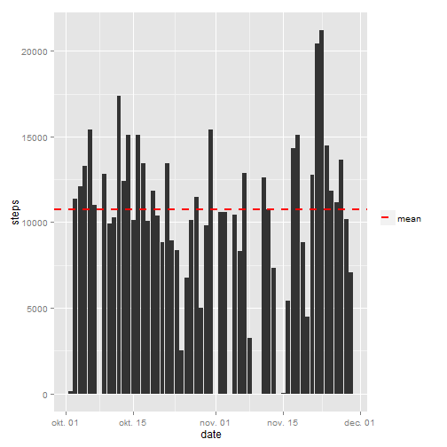

This work is licensed under [Creative Commons Attribution-NonCommercial 
4.0 International License](http://creativecommons.org/licenses/by-nc/4.0/)  
Copyrigth (c) 2015 Istvan Szente | <szente.istvan@gmail.com>

## Introduction

It is now possible to collect a large amount of data about personal movement using activity monitoring devices such as a Fitbit, Nike Fuelband, or Jawbone Up. These type of devices are part of the “quantified self” movement – a group of enthusiasts who take measurements about themselves regularly to improve their health, to find patterns in their behavior, or because they are tech geeks. But these data remain under-utilized both because the raw data are hard to obtain and there is a lack of statistical methods and software for processing and interpreting the data.

This assignment makes use of data from a personal activity monitoring device. This device collects data at 5 minute intervals through out the day. The data consists of two months of data from an anonymous individual collected during the months of October and November, 2012 and include the number of steps taken in 5 minute intervals each day.

## Data

Dataset can be downloaded from here: [Activity monitoring data [52K]](https://d396qusza40orc.cloudfront.net/repdata%2Fdata%2Factivity.zip)

The variables included in this dataset are:

* steps: Number of steps taking in a 5-minute interval (missing values are coded as NA)
* date: The date on which the measurement was taken in YYYY-MM-DD format
* interval: Identifier for the 5-minute interval in which measurement was taken

The dataset is stored in a comma-separated-value (CSV) file and there are a total of 17,568 observations in this dataset.

## Assignment

### Loading and preprocessing the data


```r
## Checks if source file exist.
if (!file.exists("activity.csv")) {

    ## If source file does not exist, then checks if ZIP file exist, 
    ## else downloads it into working directory.
    zipFile <- "activity.zip"
    if (!file.exists(zipFile)) {
        url <- "https://d396qusza40orc.cloudfront.net/repdata%2Fdata%2Factivity.zip"
        setInternet2(use = TRUE)
        download.file(url, zipFile)
    }

    ## Extracts the ZIP file into working directory.
    unzip(zipFile, overwrite = TRUE)
}

## Reads raw data.
data <- read.csv("activity.csv", header = TRUE, stringsAsFactors = FALSE)
summary(data)
```

```
##      steps            date              interval     
##  Min.   :  0.00   Length:17568       Min.   :   0.0  
##  1st Qu.:  0.00   Class :character   1st Qu.: 588.8  
##  Median :  0.00   Mode  :character   Median :1177.5  
##  Mean   : 37.38                      Mean   :1177.5  
##  3rd Qu.: 12.00                      3rd Qu.:1766.2  
##  Max.   :806.00                      Max.   :2355.0  
##  NA's   :2304
```

Raw data has a __date__ column imported as character, that needs to be converted to date.


```r
## Converts date column from character to date.
data$date <- as.Date(data$date)
summary(data)
```

```
##      steps             date               interval     
##  Min.   :  0.00   Min.   :2012-10-01   Min.   :   0.0  
##  1st Qu.:  0.00   1st Qu.:2012-10-16   1st Qu.: 588.8  
##  Median :  0.00   Median :2012-10-31   Median :1177.5  
##  Mean   : 37.38   Mean   :2012-10-31   Mean   :1177.5  
##  3rd Qu.: 12.00   3rd Qu.:2012-11-15   3rd Qu.:1766.2  
##  Max.   :806.00   Max.   :2012-11-30   Max.   :2355.0  
##  NA's   :2304
```

### Loading required packages for data preparation and reporting


```r
require(dplyr)
require(ggplot2)
```

### What is mean total number of steps taken per day?


```r
## Prepares data for reporting, by calculating 
## the total number of steps taken each day.
repData <- data %>% group_by(date) %>% summarise(steps = sum(steps))

## Calculates mean and median of total number of steps taken per day.
meanSteps <- mean(repData$steps, na.rm = TRUE)
medianSteps <- median(repData$steps, na.rm = TRUE)

## Plots a histogram of the total number of steps 
## taken each day showing the mean as a vertical line.
ggplot(repData, aes(steps)) + 
    geom_histogram(binwidth = 1000) + 
    geom_vline(aes(xintercept = meanSteps, colour = "mean"), 
               linetype = "dashed", size = 1, show_guide = TRUE) +
    scale_colour_manual(name = "", values = c("mean" = "red"))
```

 

```r
## Plots a bar graph of the total number of steps
## taken each day showing the mean as a horizontal line.
ggplot(repData, aes(x=date, y=steps)) + 
    geom_bar(stat = "identity") + 
    geom_hline(aes(yintercept = meanSteps, colour = "mean"), 
               linetype = "dashed", size = 1, show_guide = TRUE) +
    scale_colour_manual(name = "", values = c("mean" = "red"))
```

 


Mean and median of total number of steps taken per day:

Mean          | Median   
--------------|----------------
10766.189 | 10765

### What is the average daily activity pattern?


```r
## Prepares data for reporting, by calculating 
## the average number of steps taken each interval.
repData <- data %>% group_by(interval) %>% 
    summarise(steps = mean(steps, na.rm = TRUE))

## Computes which 5-minute interval, on average across all the days 
## in the dataset, contains the maximum number of steps.
maxInterval <- as.integer(repData %>% filter(steps == max(steps)) %>% select(interval))

## Plots a time series of the average number of steps taken each interval.
ggplot(repData, aes(x = interval, y = steps)) + geom_line() +
    geom_vline(aes(xintercept = maxInterval, color = "max"),
               linetype = "dashed", size = 1, show_guide = TRUE) +
    scale_color_manual(name = "", values = c("max" = "red"))
```

 

__835__ is the 5-minute interval, that contains the maximum number of steps, on average across all the days in the dataset.

### Imputing missing values

There are a number of days/intervals where there are missing values (coded as NA). The presence of missing days may introduce bias into some calculations or summaries of the data.


```r
## Calculates the total number of missing values in the dataset.
missingValues <- sum(is.na(data$steps))
```

The total number of missing values in the dataset is __2304__.

Missing values have been imputed by filling in all of them in the dataset using the mean for the corresponding 5-minute interval, calculated in the previous step.


```r
## Creates a new dataset that is equal to the original dataset 
## but with the missing data filled in.
impData <- data
impData[is.na(impData$steps), ]$steps = as.numeric(repData$steps)

## Prepares data for reporting, by calculating 
## the total number of steps taken each day.
repData <- impData %>% group_by(date) %>% summarise(steps = sum(steps))

## Calculates mean and median of total number of steps taken per day.
meanStepsImp <- mean(repData$steps, na.rm = TRUE)
medianStepsImp <- median(repData$steps, na.rm = TRUE)

## Plots a histogram of the total number of steps 
## taken each day showing the mean as a vertical line.
ggplot(repData, aes(steps)) + 
    geom_histogram(binwidth = 1000) + 
    geom_vline(aes(xintercept = meanStepsImp, colour = "mean"), 
               linetype = "dashed", size = 1, show_guide = TRUE) +
    scale_colour_manual(name = "", values = c("mean" = "red"))
```

 


Mean and median of total number of steps taken per day:

Data  | Before imputing  | After imputing
------|------------------|-------------------
Mean  | 10766.189    | 10766.189
Median| 10765  | 10766.189

It can be seen that that mean value has not changed, but median equals to mean after imputing missing values by filling in using the mean for the corresponding 5-minute interval.

### Are there differences in activity patterns between weekdays and weekends?


```r
## Adds weekday/weekend information to imputed dataset.
dayType <- as.factor(c("weekend", "weekday", "weekday", "weekday", "weekday", "weekday", "weekend"))
impData$daytype <- dayType[as.POSIXlt(impData$date)$wday + 1]

## Prepares data for reporting, by calculating 
## the average number of steps taken each daytype and interval.
repData <- impData %>% group_by(daytype, interval) %>% 
    summarise(steps = mean(steps, na.rm = TRUE))

## Makes a panel plot containing a time series plot of the 5-minute interval
## (x-axis) and the average number of steps taken, averaged across all 
## weekday days or weekend days (y-axis).
ggplot(repData, aes(x = interval, y = steps)) + 
    facet_wrap(~daytype, ncol = 1) +
    geom_line()
```

 
